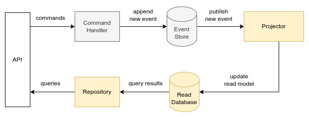
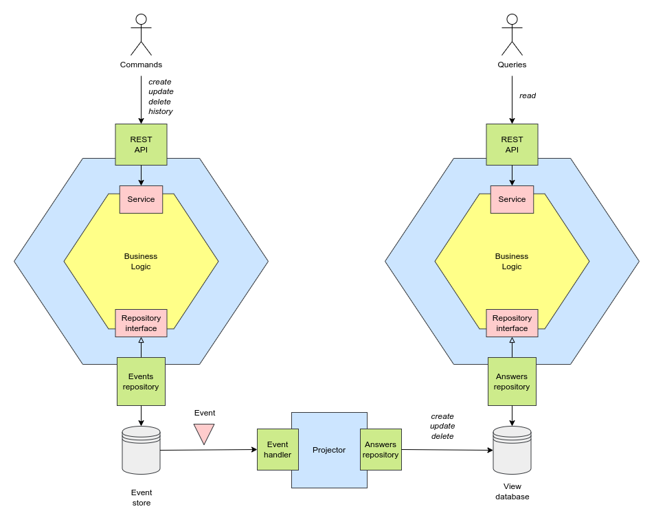

# Q&A Service

A service that exposes a REST API which allows to create, update, delete and retrieve answers as key-value pairs. 

An `answer` can be defined as:

```
key: string
value: string
```

e.g. in JSON:

```
{
  "key": "name",
  "value": "John"
}
```

## Endpoints

The API exposes the following endpoints:

- `POST /answers` - Create answer
- `PATCH /answers` - Update answer
- `GET /answers/{key}` - Get answer (returns the latest answer for the given key)
- `DELETE /answers/{key}` - Delete answer
- `GET /answers/{key}/history` - Get history for given key (returns an array of events in chronological order)

An `event` can be defined as:

```
event: string
data: answer
```

e.g. in JSON:

```
{
  "event": "create",
  "data": {
    "key": "name",
    "value": "John"
  }
}
```

## Application requirements

If a user saves the same key multiple times (using update), every answer should be saved. When retrieving an answer, it should return the latest answer.

If a user tries to create an answer that already exists - the request should fail and an adequate message or code should be returned.

If an answer doesn't exist or has been deleted, an adequate message or code should be returned.

When returning history, only mutating events (create, update, delete) should be returned. The "get" events should not be recorded.

It is possible to create a key after it has been deleted. However, it is not possible to update a deleted key. For example the following event sequences are allowed:

```
create → delete → create → update
```

```
create → update → delete → create → update
```

However, the following should not be allowed:

```
create → delete → update
```

```
create → create
```

## Architecture

Design Patterns used:
- [Event Sourcing](https://www.eventstore.com/event-sourcing)
- [CQRS](https://www.eventstore.com/cqrs-pattern)

Services:
- EventStore
- Projection
- Projector

The EventStore service represents the write side of the application.

The Projection service represents the read side of the application.

The Projector service synchronizes read and write data.



Databases used:
- [EventStoreDB](https://www.eventstore.com/) as event store
- [MongoDB](https://www.mongodb.com/) as read repository




## Run

### Define the environment variables

Create a `.env` file with the following variables:

```
EVENTSTORE_HOST=localhost

MONGODB_HOST=localhost
MONGODB_USER=root
MONGODB_PASS=example
```

### Run it with `docker-compose`

```
$ docker-compose up -d
```


## Usage examples

Notice the difference in the port being used:

-  `localhost:8080` for the event store service
-  `localhost:8081` for the projection service

### Create answer

```
$ curl -X POST -d '{
    "key":"name",
    "value":"john"
}' http://localhost:8080/answers
```

Successful Response:

```
{
  "ok": "AnswerCreatedEvent"
}
```

### Get answer by key

```
$ curl http://localhost:8081/answers/name
```

Response:

```
{
  "key": "name",
  "value": "john"
}
```

### Create answer with existing key

```
$ curl -X POST -d '{
    "key":"name",
    "value":"john"
}' http://localhost:8080/answers
```

Error:

```
{
  "error": "Key exists"
}
```

### Get history for a given key

```
$ curl http://localhost:8080/answers/name/history
```

Response:

```
[
  {
    "type": "AnswerCreatedEvent",
    "data": {
      "key": "name",
      "value": "john"
    }
  }
]
```

### Update answer

```
$ curl -X PATCH -d '{
    "key":"name",
    "value":"jack"
}' http://localhost:8080/answers
```

Response:

```
{
  "ok": "AnswerUpdatedEvent"
}
```

### Fetch the updated key

```
$ curl http://localhost:8081/answers/name
```

Response:

```
{
  "key": "name",
  "value": "jack"
}
```


## Development 

Requires to [define the environment variables](#define-the-environment-variables).

### Run the databases (optional)

```
$ docker-compose up -d mongo eventstore.db
```
Find the EventStoreDB dashboard at 
http://localhost:2113/.

Mongo cli:

```
$ mongo --host localhost --port 27017 -u root -p example

---

> use qaservice
> db.answers.find()
```

### Debug the services

As a monolith / single-process:

```
$ godotenv go run ./monolith/.
```

As separate processes:

```
$ godotenv go run ./eventstore/cmd/.

$ godotenv go run ./projection/cmd/.

$ godotenv go run ./projector/cmd/.
```

### Debug the services without databases

It applies only to single process running mode.

Use `-memdb` parameter to run the services with in-memory db.

```
$ IP_PORT=:8080 go run ./monolith/. -memdb
```

### Build 

```
$ docker-compose build
```

### Run

```
$ docker-compose up -d
```


## Test

Clean test-cache (optional) :
```
$ go clean -testcache 
```

Run all tests (requires [databases to be up](#run-the-databases-optional)):

```
$ godotenv go test ./...
```

Skip tests flagged as "short":

```
$ godotenv go test -short ./...
```


## Kubernetes (Minikube)

Works on Minikube.

```
$ minikube start
```

To keep things simple, in the following workflow pods use databases running on host.

Pods use `host.minikube.internal` as address to access dbs on host.

https://minikube.sigs.k8s.io/docs/handbook/host-access/

### Run the databases

```
$ docker-compose up -d mongo eventstore.db
```

### Setup (docker-env)

For building docker images directly inside minikube:

```
$ eval $(minikube -p minikube docker-env)
```

https://minikube.sigs.k8s.io/docs/handbook/pushing/#1-pushing-directly-to-the-in-cluster-docker-daemon-docker-env

> Tip 2: Evaluating the docker-env is only valid for the current terminal. By closing the terminal, you will go back to using your own system’s docker daemon.

### Build images

```
$ docker build -t qaservice-eventstore:1.0 --build-arg="SERVICE=eventstore" .

$ docker build -t qaservice-projection:1.0 --build-arg="SERVICE=projection" .

$ docker build -t qaservice-projector:1.0 --build-arg="SERVICE=projector" .
```

### Deploy

```
$ kubectl apply -f kubernetes-deployment.yml
```

### Deploy without docker-env setup

For each service do:

```
docker build -t qaservice-<service> --build-arg="SERVICE=<service>" .

docker tag qaservice-$service <registry handle>/qaservice-<service>:1.0

docker push <registry handle>/qaservice-<service>:1.0

kubectl apply -f kubernetes-deployment.yml
```

Solution to ImagePullBackOff error:

```
minikube image load qaservice-<service>:1.0
```

### Usage

Services address:

- Event store: `$(minikube service qaservice-eventstore --url)`

- Projection: `$(minikube service qaservice-projection --url)`

POST example: 

```
$ curl -X POST -d '{
    "key":"name",
    "value":"john"
}' $(minikube service qaservice-eventstore --url)/answers
```

GET example:

```
$ curl $(minikube service qaservice-projection --url)/answers/name
```
